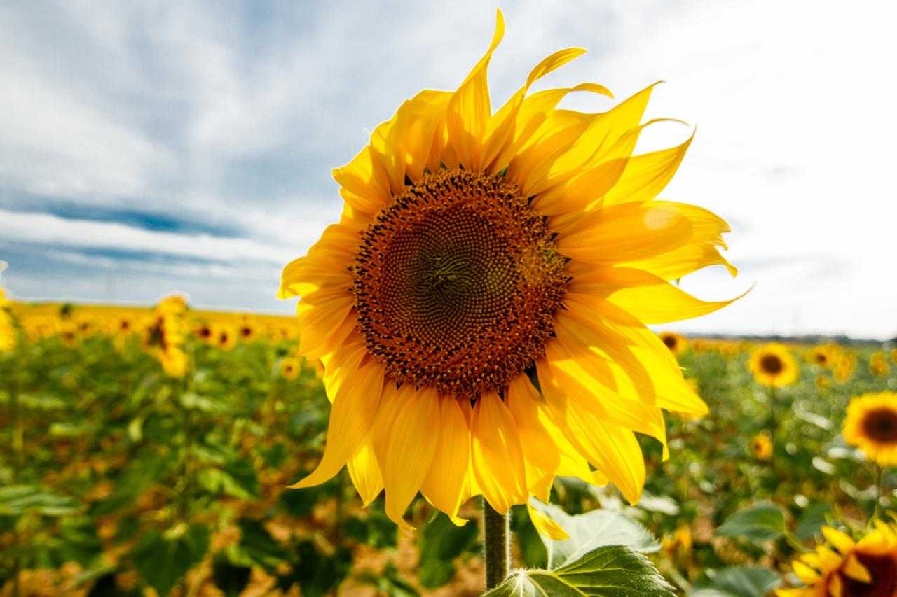

# Create a GIF with Python

## Introduction
This project demonstrates how to create an animated GIF from a series of images using Python and the imageio library. With just a few lines of code, you can combine multiple images to generate an animated GIF.

### How it Works
Prepare your image files: Ensure you have the image files you want to include in the GIF.
Run the Python script: Execute the provided Python script to create the GIF from the images.
### Images

### GIF Preview

## Conclusion
Creating a GIF from images is quick and easy with Python. You don't need complex software - just a few lines of code and the imageio library. Experiment with different images and durations to create your own custom GIFs!
